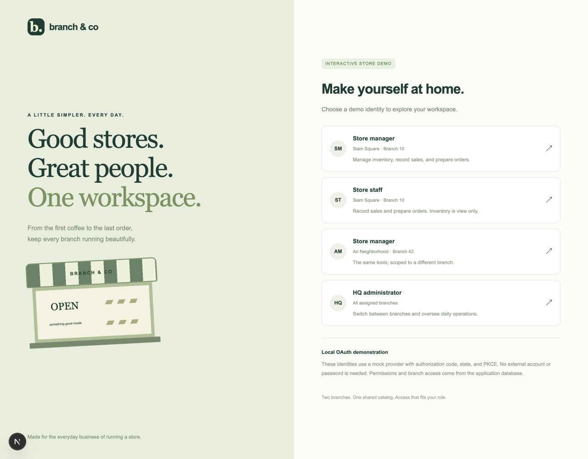
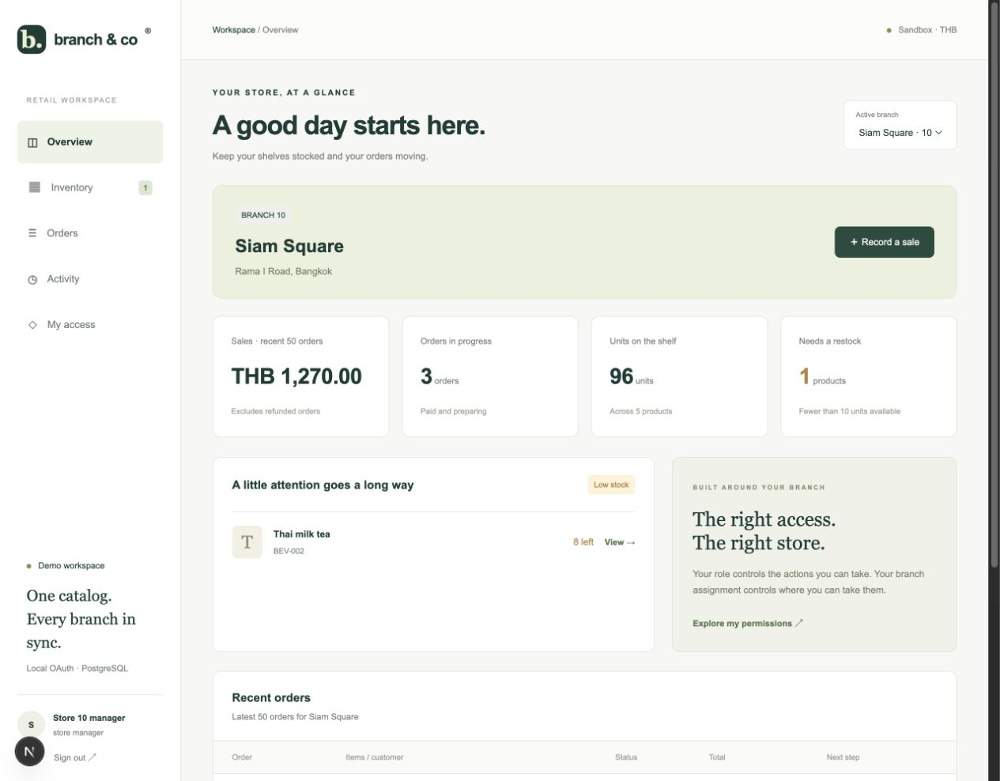
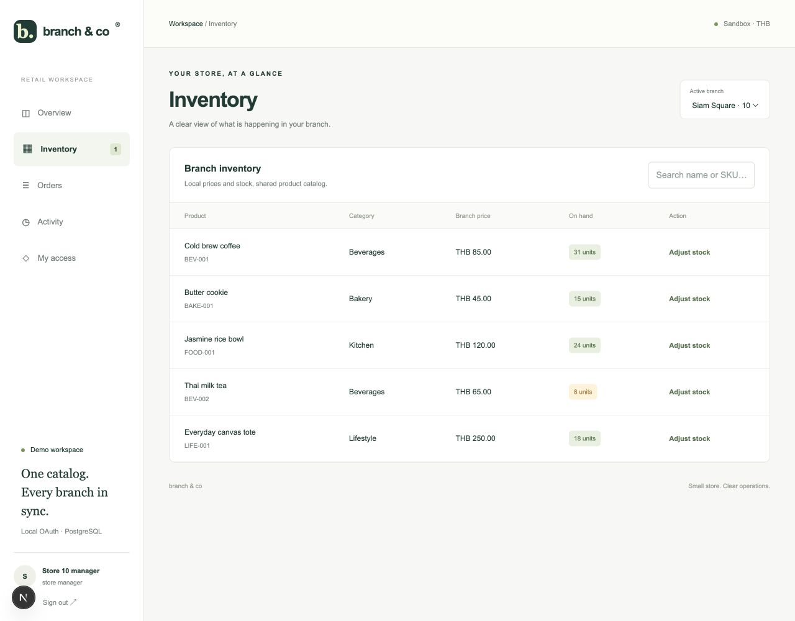
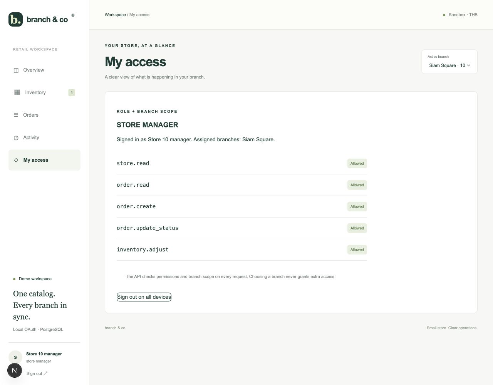
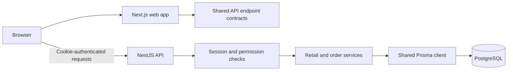

# Branch & Co

A simple multi-branch retail management demo with OAuth-style sign-in, role-based permissions, and branch-scoped access. Record sales, manage inventory, prepare orders, and see who changed stock—all backed by PostgreSQL.

Built on the existing **Monex Turbo-style template**: npm workspaces, Turborepo, Next.js, NestJS, Prisma, and shared API, UI, design-system, and configuration packages.

> Sign-in uses a **local mock OAuth provider** with state and PKCE. It does not connect to ThaiD, Google, or another real identity provider. Mock authentication is disabled in production mode.

## Screenshots

These screenshots show the running app with seeded demonstration data. Totals and stock change as you use the demo.

### Choose a demo identity

Sign in as a store manager, staff member, or HQ administrator to compare permissions and branch access.



### Branch overview

See recent sales, orders in progress, units on hand, and products that need restocking. Managers see their assigned branch; HQ can switch between assigned branches.



### Inventory

Search the shared catalog, inspect branch-specific prices, and adjust stock with a reason. Staff can view inventory, while managers and HQ can change it.



### My access

Inspect the signed-in role and its grants. The API independently checks permissions and resource scope for every request.



## What you can demonstrate

- **Branch operations:** Siam Square (branch 10) and Ari Neighborhood (branch 42), sharing a five-product catalog with local prices and stock.
- **Sales:** record a paid, single-product sale; the API calculates its total and snapshots the product name and unit price.
- **Order workflow:** move orders from `PAID` to `PREPARING` to `READY`.
- **Inventory:** add or remove stock with a reason, with low-stock indicators below 10 units.
- **Activity:** view the latest sale and inventory-adjustment audit events for a branch.
- **Authentication:** authorization-code redirects, state validation, PKCE, encrypted HttpOnly cookies, and revocable database sessions.
- **Authorization:** role permissions determine what a user may do; tenant, region, and store assignments determine which resources they may access.

The overview summarizes the **latest 50 orders per branch**, excluding refunded orders from the sales card. Activity shows the latest 15 events.

## Roles and branch scope

- **Siam Square manager:** view branch 10, record sales, prepare orders, and adjust stock.
- **Siam Square staff:** view branch 10, record sales, and prepare orders; inventory adjustments are denied.
- **Ari manager:** the same manager actions, limited to branch 42.
- **HQ administrator:** operate across assigned branches 10 and 42. HQ still needs explicit branch assignments.

The retail workspace uses `store.read`, `order.read`, `order.create`, `order.update_status`, and `inventory.adjust`. The inherited customer identity remains API-only; customers cannot open the store-manager workspace.

Hiding or disabling a button is only a UI aid. NestJS loads the actor's current grants and assignments from PostgreSQL and enforces access on every request, including direct API calls.

## Architecture



- **Frontend:** Next.js App Router and React; TanStack Query handles API state through the frontend-owned fetch client.
- **Backend:** NestJS owns authentication, validated DTOs, authorization, and business transactions.
- **Database:** Prisma models and SQL migrations define relationships, indexes, and constraints.
- **Shared packages:** runtime-independent API contracts, reusable UI and icons, design-system styles, and common lint/test/TypeScript configuration.

```text
apps/
  web/                  Next.js pages, dashboard, fetch client, query provider
  api/                  NestJS auth, retail, and order modules
  db/                   PostgreSQL Docker Compose service
packages/
  api-client/           Typed endpoint contracts and response types
  prisma/               Schema, migrations, seed, and shared Prisma client
  ui/                   Shared UI components
  design-system/        Shared styling and design tokens
  icons/                Shared icon components
  eslint-config/        Shared lint rules
  jest-config/          Shared test configuration
  typescript-config/    Shared TypeScript configuration
docs/screenshots/       Screenshots embedded in this README
scripts/test-retail.mjs End-to-end API checks against the local demo
```

## Quick start

### 1. Install dependencies

Requirements: **Node.js 22.12+**, npm, and Docker with Compose.

```sh
npm ci
```

Installation creates `.env` from `.env.example` if it does not already exist.

### 2. Configure the environment

Generate a secret and put its value in `AUTH_COOKIE_SECRET` in `.env`:

```sh
node -e "console.log(require('node:crypto').randomBytes(32).toString('base64url'))"
```

Check these settings in `.env`:

- `DATABASE_URL`: PostgreSQL connection string. Keep it aligned with `DB_USER`, `DB_PASSWORD`, `DB_NAME`, and `DB_PORT`; update it explicitly when changing database settings.
- `API_PORT` and `API_PUBLIC_URL`: backend listener and OAuth callback base URL.
- `NEXT_PUBLIC_API`: browser-facing API URL.
- `WEB_ORIGIN` and `WEB_URL`: frontend origin and post-login destination. They must match the actual frontend URL.
- `NODE_ENV=development`: enables the local mock sign-in flow.

The template defaults are web **3000**, API **3001**, and PostgreSQL **5433**. Keep secrets out of version control.

### 3. Start PostgreSQL and prepare the schema

```sh
npm run env:distribute
npm run db:up
npx prisma migrate deploy --config packages/prisma/prisma.config.ts
npm run db:seed
```

If your Docker installation provides `docker compose` rather than the standalone `docker-compose` command used by the package script, use:

```sh
docker compose --env-file .env -f apps/db/docker-compose.yml up -d postgres
```

Use migrations rather than `db:push` to retain the SQL checks for stock, quantities, and prices.

### 4. Build shared packages and run

```sh
npm run build
npm run dev
```

Open [the web app](http://localhost:3000). API documentation is available at [Swagger UI](http://localhost:3001/api).

`npm run build` verifies the production build. Use development mode to try mock sign-in; a real OAuth/OIDC provider is required for production authentication.

### Existing local workspace

The workspace used for these screenshots is configured on [localhost:3100](http://localhost:3100), with API [localhost:3101](http://localhost:3101/api) and an isolated `branch-retail-demo-db` PostgreSQL container on port **55435**. See [the local restart instructions](RETAIL_DEMO.md#current-local-workspace) if using that configuration. Fresh checkouts use the defaults above unless you change `.env`.

## Five-minute walkthrough

1. Sign in as **Store manager — Siam Square**.
2. Open **Inventory**, adjust a product's stock, and enter a delivery reason.
3. Open **Activity** to see the change and its actor.
4. **Record a sale**; check the saved item price and reduced stock.
5. Open **Orders**, start preparing the sale, and mark it ready.
6. Sign out and choose **Store staff**; inventory adjustments are disabled and the API denies attempts to bypass the UI.
7. Try **Ari manager** or **HQ administrator** to compare branch scope, then inspect **My access**.

## Try a denied action

In **Orders**, Refund buttons use per-order capabilities computed by the API. As the Siam Square manager, order 902 is denied because it exceeds the THB 500 refund limit. Staff cannot refund any order.

Check **Demo: enable denied refund buttons**, then click a denied refund. The UI displays the actual **HTTP 403** response and JSON error. The checkbox only enables the button; it does not change backend authorization. Both capability generation and refund execution reuse the same backend policy, and capabilities refresh after an attempt.

An allowed demo refund changes order status only—no payment or stock return is processed. See [the capability walkthrough](RETAIL_DEMO.md#capability-override-demonstration).

## Database design

The implementation follows the retail examples in the supplied Database Design Fast Track guide and multi-branch ERD:

- `StoreProduct` resolves the store/product relationship and owns each branch's price, stock, and availability.
- `OrderItem` preserves transaction-time prices and product names so receipts do not change with the catalog.
- `InventoryMovement` records stock changes; `StoreProduct.stock` is the current authoritative quantity.
- `RolePermission` defines grants, while `UserStore` separately defines resource scope.
- `AuditEvent` records sale creation and inventory adjustments.

A sale writes the order, stock decrement, inventory movement, and audit event in one transaction. Conditional stock updates prevent concurrent purchases from overselling. SQL constraints enforce nonnegative stock and prices, positive purchased quantities, and unique branch/product membership.

This deliberately small demo retains the starter's **one role per user** and customer identifiers. Product catalog editing, multi-line checkout, actual payments/refunds, promotions, webhooks, external integrations, and multi-role administration are outside its scope. The inherited order-status endpoint does not write audit events.

See [the detailed ERD mapping and limitations](RETAIL_DEMO.md#mapping-to-the-supplied-pdfs) and [authentication flow notes](apps/web/AUTH_DEMO.md).

## Validation

```sh
npm run build
npm run test --workspace=api -- --runInBand
npm run test --workspace=web -- --runInBand
npm run lint --workspace=api
npm run lint --workspace=web
npm run lint --workspace=@repo/api-client
npm run test:retail
```

`test:retail` requires a running, seeded development API and reads its URLs from `.env`. It verifies OAuth login, session revocation, role denials, branch isolation, input validation, trusted-origin checks, receipt prices, order transitions, and concurrent stock protection.

**Run it only against a local demo database:** it creates a test sale and audit entries, restores the tested product's starting stock, and revokes its test sessions.

## Key implementation files

- [Retail service and transactions](apps/api/src/retail/retail.service.ts)
- [Retail controller](apps/api/src/retail/retail.controller.ts)
- [OAuth demo service](apps/api/src/auth/auth.service.ts)
- [Session authentication and revocation](apps/api/src/auth/session.service.ts)
- [Shared retail contracts](packages/api-client/src/retail.ts)
- [Database schema](packages/prisma/prisma/schema.prisma)
- [Demo seed](packages/prisma/prisma/seed.ts)
- [Store dashboard](apps/web/components/store-dashboard.tsx)

This repository is an educational proof of concept. Mock code-replay protection is process-local; a real deployment needs a real identity-provider adapter and durable one-time authorization-flow storage.
